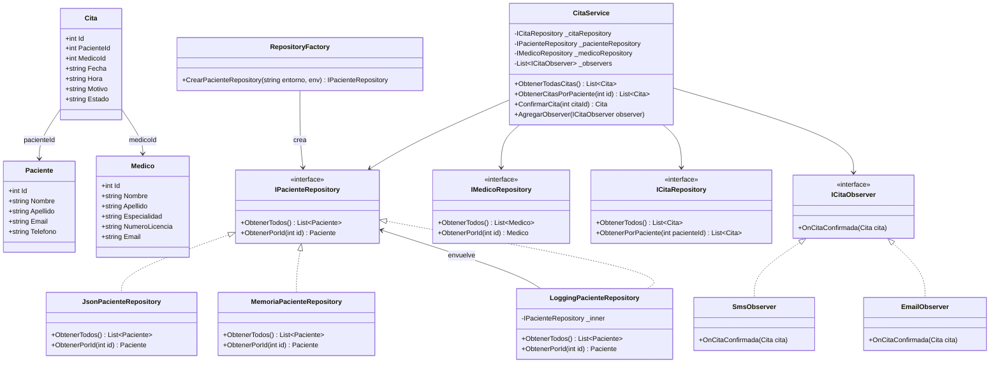
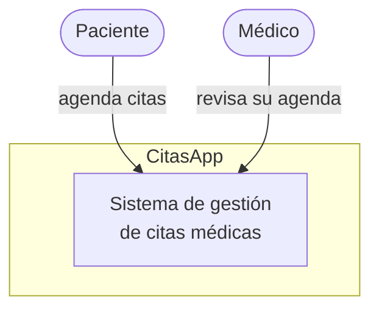
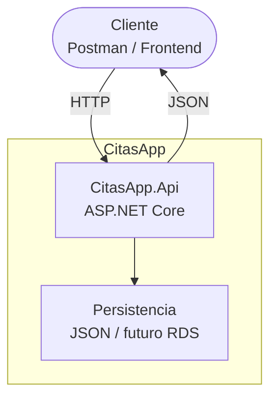
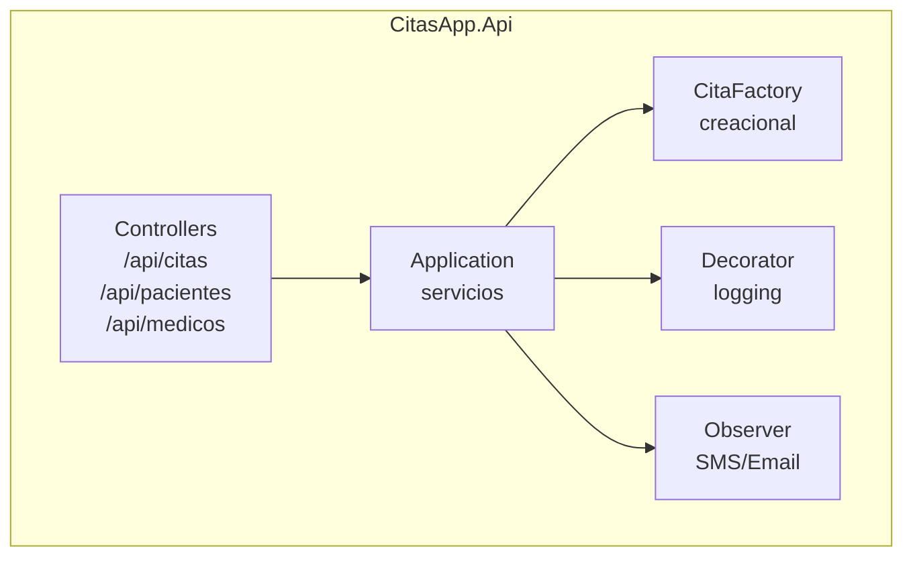

# Arquitectura — CitasApp

## Diagrama de Clases

```mermaid
classDiagram
    class Paciente {
        +int Id
        +string Nombre
        +string Apellido
        +string Email
        +string Telefono
    }

    class Medico {
        +int Id
        +string Nombre
        +string Apellido
        +string Especialidad
        +string NumeroLicencia
        +string Email
    }

    class Cita {
        +int Id
        +int PacienteId
        +int MedicoId
        +string Fecha
        +string Hora
        +string Motivo
        +string Estado
    }

    class IPacienteRepository {
        <<interface>>
        +ObtenerTodos() List~Paciente~
        +ObtenerPorId(int id) Paciente
    }

    class IMedicoRepository {
        <<interface>>
        +ObtenerTodos() List~Medico~
        +ObtenerPorId(int id) Medico
    }

    class ICitaRepository {
        <<interface>>
        +ObtenerTodos() List~Cita~
        +ObtenerPorPaciente(int pacienteId) List~Cita~
    }

    class ICitaObserver {
        <<interface>>
        +OnCitaConfirmada(Cita cita)
    }

    class JsonPacienteRepository {
        +ObtenerTodos() List~Paciente~
        +ObtenerPorId(int id) Paciente
    }

    class MemoriaPacienteRepository {
        +ObtenerTodos() List~Paciente~
        +ObtenerPorId(int id) Paciente
    }

    class LoggingPacienteRepository {
        -IPacienteRepository _inner
        +ObtenerTodos() List~Paciente~
        +ObtenerPorId(int id) Paciente
    }

    class RepositoryFactory {
        +CrearPacienteRepository(string entorno, env) IPacienteRepository
    }

    class SmsObserver {
        +OnCitaConfirmada(Cita cita)
    }

    class EmailObserver {
        +OnCitaConfirmada(Cita cita)
    }

    class CitaService {
        -ICitaRepository _citaRepository
        -IPacienteRepository _pacienteRepository
        -IMedicoRepository _medicoRepository
        -List~ICitaObserver~ _observers
        +ObtenerTodasCitas() List~Cita~
        +ObtenerCitasPorPaciente(int id) List~Cita~
        +ConfirmarCita(int citaId) Cita
        +AgregarObserver(ICitaObserver observer)
    }

    Cita --> Paciente : pacienteId
    Cita --> Medico : medicoId

    IPacienteRepository <|.. JsonPacienteRepository
    IPacienteRepository <|.. MemoriaPacienteRepository
    IPacienteRepository <|.. LoggingPacienteRepository
    LoggingPacienteRepository --> IPacienteRepository : envuelve

    ICitaObserver <|.. SmsObserver
    ICitaObserver <|.. EmailObserver

    CitaService --> ICitaRepository
    CitaService --> IPacienteRepository
    CitaService --> IMedicoRepository
    CitaService --> ICitaObserver

    RepositoryFactory --> IPacienteRepository : crea
```

---

## C4 Nivel 1 — Contexto

```mermaid
graph TD
    Paciente([Paciente])
    Medico([Médico])

    subgraph CitasApp
        Sistema[Sistema de gestión\nde citas médicas]
    end

    Paciente -->|agenda citas| Sistema
    Medico -->|revisa su agenda| Sistema
```

---

## C4 Nivel 2 — Contenedores

```mermaid
graph TD
    Cliente([Cliente\nPostman / Frontend])

    subgraph CitasApp
        Api[CitasApp.Api\nASP.NET Core]
        Persistencia[Persistencia\nJSON / futuro RDS]
    end

    Cliente -->|HTTP| Api
    Api -->|JSON| Cliente
    Api --> Persistencia
```

---

## C4 Nivel 3 — Componentes dentro de CitasApp.Api

```mermaid
graph TD
    subgraph CitasApp.Api
        Controllers[Controllers\n/api/citas\n/api/pacientes\n/api/medicos]
        Application[Application\nservicios]
        Factory[CitaFactory\ncreacional]
        Decorator[Decorator\nlogging]
        Observer[Observer\nSMS/Email]
    end

    Controllers --> Application
    Application --> Factory
    Application --> Decorator
    Application --> Observer
```

---

